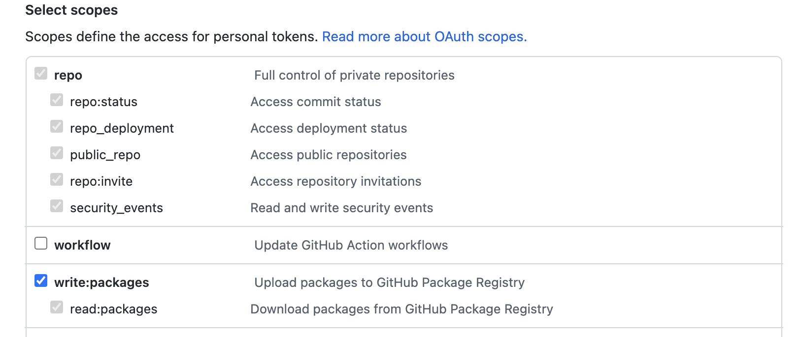

# Hundo Design System 🎨

<p>
<a href="https://github.com/hundo-careers/hundo-design-system/actions/workflows/chromatic.yml">

</a>

## Getting started:

__Start development server:__
```shell
npm i && npm run dev
```

__Release new version:__
```shell
npm run release
```

## Component design:

__Atomic Design:__
The components should be built using Atomic Design principles, this means that they are broken down into Atoms, Molecules, Organisms and Templates. The majority of components will be either Atoms or Molecules but you can find a comprehensive guide of their definitions [here](https://xd.adobe.com/ideas/process/ui-design/atomic-design-principles-methodology-101/).

## How to use:

__Generate Token:__
In order to use the package within another repository, you'll need to set up an `.npmrc` file with the following contents:

```shell
@hundo-careers:registry=https://npm.pkg.github.com
```

You will then need to create a Github Personal Access Token, that can be used to autheicate yourself locally. To do this, click [this link](https://github.com/settings/tokens) and generate a new token. You should select the following scope:



__Set Registry:__
You will then need to run this command to login into Github Package manager:

```shell
npm login --scope=@hundo-careers --registry=https://npm.pkg.github.com

> Username: YOUR GITHUB USERNAME
> Password: GENERATED TOKEN
> Email: YOUR GITHUB EMAIL ADDRESS

```

__Install:__ 
Once logged in, you should be able to consume the package using the following commands:
```shell
npm install @hundo-careers/hundo-design-system
```

or 

```shell
yarn add @hundo-careers/hundo-design-system
```

__Import:__ 
```js
import { ThemeProvider, Button } from 'hundo-design-system';

const App = () => {
  return (
    <div className="App">
      <ThemeProvider>
        <Button label="Hundo" />
      </ThemeProvider>
    </div>
  );
}
```

## Theming:

__Using a theme:__ 

The library includes a `ThemeProvider`, which is a component that provides the capacity to introduce themes to our base components. This utilises the Styled Components theme provider and docs can be found [here](https://styled-components.com/docs/advanced#theming).


```js
import { ThemeProvider, Button } from 'hundo-design-system';

const App = () => {
  return (
    <ThemeProvider theme="dark">
      <Button label="Hundo is dark" />
    </ThemeProvider>;
  );
}
```

__Creating a theme:__ 

Currently, we have only defined a single default theme, which is automatically set when using the `ThemeProvider`. However, you are able to create a new theme using the theme structure outlined in `src/components/theme/index.ts`:

```js
// First, declare the new theme
declare module 'styled-components' {
  export interface NewTheme extends CustomTheme {
    // New definition
  }
}

// Next, create the theme
export const newTheme: NewTheme = {
  name: 'New',
  colors: {
    primary: '#333333',
    secondary: '#f1f1f1',
  },
};
```